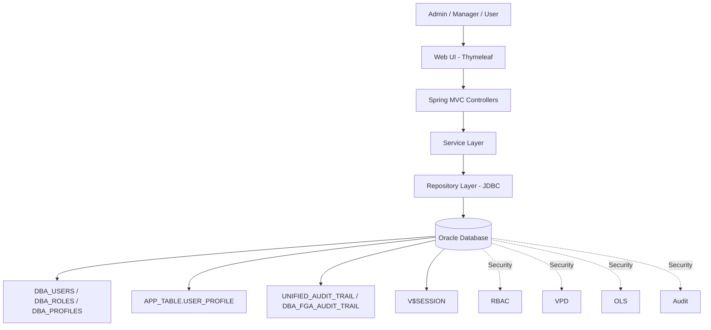
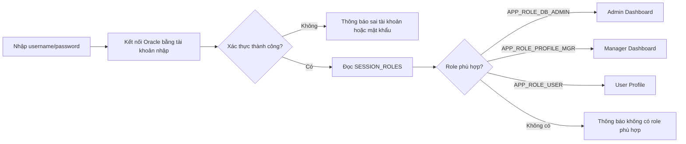
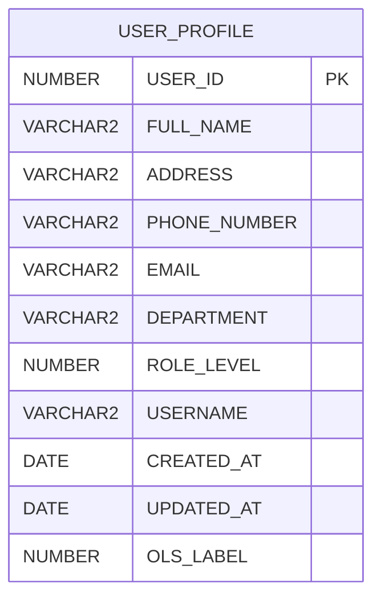
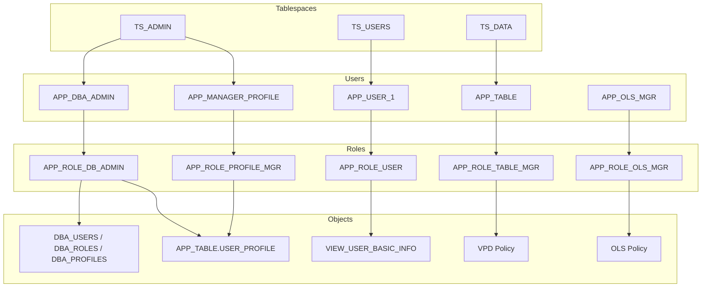
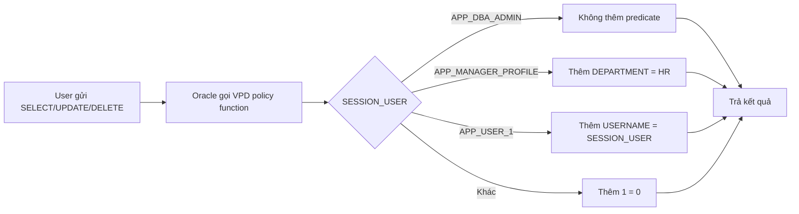
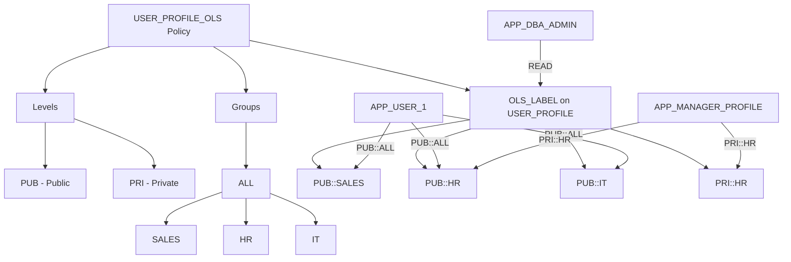
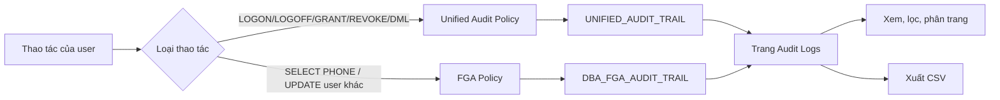

# CHƯƠNG 2. PHÂN TÍCH VÀ THIẾT KẾ HỆ THỐNG

Chương này trình bày kết quả phân tích yêu cầu và thiết kế mức quan niệm cho hệ thống quản lý người dùng Oracle. Hệ thống được xây dựng bằng Java Spring Boot, giao diện Thymeleaf và kết nối trực tiếp đến Oracle Database để thực hiện các chức năng quản trị user, role, profile, audit và session. Bên cạnh các chức năng quản trị, hệ thống còn áp dụng nhiều cơ chế bảo mật cơ sở dữ liệu như RBAC, VPD, OLS và Audit nhằm đảm bảo phân quyền chặt chẽ, kiểm soát truy cập theo ngữ cảnh và ghi nhận nhật ký thao tác.

## 2.1. Phân tích yêu cầu hệ thống

### 2.1.1. Yêu cầu chức năng

#### a. Chức năng đăng nhập và phân luồng người dùng

Người dùng đăng nhập bằng tài khoản Oracle Database. Sau khi xác thực thành công, hệ thống kiểm tra role hiện có trong `SESSION_ROLES` để phân luồng:

| Role Oracle | Nhóm người dùng | Màn hình truy cập |
|---|---|---|
| `APP_ROLE_DB_ADMIN` | Quản trị viên | `/admin/dashboard` |
| `APP_ROLE_PROFILE_MGR` | Quản lý hồ sơ | `/manager/dashboard` |
| `APP_ROLE_USER` | Người dùng thường | `/user/profile` |

#### b. Chức năng quản lý User

| STT | Chức năng | Mô tả |
|---|---|---|
| 1 | Xem danh sách user | Hiển thị các user có tiền tố `APP_`, gồm username, trạng thái tài khoản, tablespace, profile, ngày tạo, ngày khóa/hết hạn. |
| 2 | Tạo user mới | Cho phép tạo user với username, password, default tablespace, temporary tablespace, profile, quota và role ban đầu. |
| 3 | Chỉnh sửa user | Cho phép thay đổi password, default tablespace, temporary tablespace và profile. |
| 4 | Khóa/mở khóa user | Thực hiện `ALTER USER ... ACCOUNT LOCK/UNLOCK`. |
| 5 | Xóa user | Xóa user khỏi hệ thống bằng `DROP USER ... CASCADE`. |
| 6 | Gán/thu hồi role | Gán hoặc thu hồi role cho user, hỗ trợ tùy chọn `WITH ADMIN OPTION`. |
| 7 | Gán/thu hồi system privilege | Quản lý các quyền hệ thống như `CREATE SESSION`, `CREATE TABLE`, ... cho user. |
| 8 | Gán/thu hồi object privilege | Quản lý quyền trên object như table/view/procedure theo owner và object name. |
| 9 | Gán/thu hồi column privilege | Quản lý quyền trên từng cột của bảng. |
| 10 | Quản lý quota | Thiết lập quota lưu trữ của user trên từng tablespace. |

#### c. Chức năng quản lý Role

| STT | Chức năng | Mô tả |
|---|---|---|
| 1 | Xem danh sách role | Hiển thị các role có tiền tố `APP_ROLE_`, trạng thái có/không có password. |
| 2 | Tạo role | Tạo role mới, có thể chọn role không mật khẩu hoặc role có mật khẩu. |
| 3 | Cập nhật password role | Thêm, đổi hoặc xóa password của role bằng `ALTER ROLE`. |
| 4 | Xóa role | Xóa role khỏi hệ thống bằng `DROP ROLE`. |
| 5 | Gán role cho user | Gán role đang chọn cho user thuộc hệ thống. |
| 6 | Gán role cho role | Cho phép xây dựng role phân cấp bằng cách gán role này cho role khác. |
| 7 | Quản lý system privilege | Gán/thu hồi system privilege cho role. |
| 8 | Quản lý object privilege | Gán/thu hồi quyền trên object cho role. |
| 9 | Quản lý column privilege | Gán/thu hồi quyền theo cột cho role. |

#### d. Chức năng quản lý Profile

| STT | Chức năng | Mô tả |
|---|---|---|
| 1 | Xem danh sách profile | Hiển thị các profile có tiền tố `APP_PROFILE_` hoặc `APP_PF_`. |
| 2 | Tạo profile | Tạo profile với các giới hạn `SESSIONS_PER_USER`, `CONNECT_TIME`, `IDLE_TIME`. |
| 3 | Chỉnh sửa profile | Cập nhật các giới hạn tài nguyên của profile. |
| 4 | Xóa profile | Xóa profile bằng `DROP PROFILE ... CASCADE`. |

#### e. Chức năng quản lý Audit

| STT | Chức năng | Mô tả |
|---|---|---|
| 1 | Xem Unified Audit Trail | Truy vấn nhật ký từ `UNIFIED_AUDIT_TRAIL`, hỗ trợ lọc theo username và khoảng ngày. |
| 2 | Xem Fine-Grained Audit | Truy vấn nhật ký từ `DBA_FGA_AUDIT_TRAIL`, hỗ trợ lọc theo username và khoảng ngày. |
| 3 | Phân trang log audit | Cho phép chọn kích thước trang 20, 50 hoặc 100 bản ghi. |
| 4 | Xuất CSV | Xuất tối đa 1000 bản ghi audit ra file `.csv` trong thư mục `exports`. |

#### f. Chức năng quản lý Session

| STT | Chức năng | Mô tả |
|---|---|---|
| 1 | Xem session | Hiển thị các session đang hoạt động từ `V$SESSION`, gồm SID, serial, username, status, máy trạm, chương trình và thời điểm login. |
| 2 | Kill session | Thực hiện `ALTER SYSTEM KILL SESSION 'sid,serial#' IMMEDIATE`. |

### 2.1.2. Yêu cầu phi chức năng

| Nhóm yêu cầu | Nội dung thiết kế |
|---|---|
| Bảo mật phân quyền | Áp dụng RBAC, mỗi user được gán role phù hợp với chức năng nghiệp vụ. |
| Bảo mật mức dòng | Áp dụng VPD trên bảng `APP_TABLE.USER_PROFILE` để tự động lọc dữ liệu theo user/phòng ban. |
| Bảo mật theo nhãn | Áp dụng OLS để gắn nhãn dữ liệu theo mức `PUB`, `PRI` và nhóm phòng ban `SALES`, `HR`, `IT`. |
| Defense in Depth | Kết hợp nhiều lớp: kiểm tra đăng nhập Oracle, role, privilege, VPD, OLS, audit và profile. |
| Hiệu năng và kiểm soát tài nguyên | Dùng Oracle Profile để giới hạn số session, thời gian kết nối và thời gian rỗi. |
| Kiểm soát lưu trữ | Dùng quota theo tablespace để tránh user sử dụng vượt dung lượng. |
| Khả năng theo dõi | Ghi nhận các thao tác đăng nhập, phân quyền và thao tác dữ liệu thông qua Unified Auditing và FGA. |
| An toàn đầu vào | Các thao tác quản trị kiểm tra định dạng Oracle identifier, giới hạn thao tác trên user/role/profile có tiền tố hệ thống. |

## 2.2. Kiến trúc tổng thể hệ thống

Hệ thống được thiết kế theo mô hình 3 lớp:

| Lớp | Thành phần trong hệ thống | Vai trò |
|---|---|---|
| Presentation Layer | Thymeleaf templates, Controller | Hiển thị giao diện web, nhận request từ người dùng, điều hướng theo role. |
| Business Logic Layer | Service classes | Xử lý nghiệp vụ quản lý user, role, profile, audit, session. |
| Data Access Layer | Repository classes, JDBC Template | Kết nối Oracle Database và thực thi SQL quản trị. |
| Database Layer | Oracle Database | Lưu trữ dữ liệu, user, role, privilege, audit trail, VPD/OLS policy. |

Sơ đồ kiến trúc mức quan niệm:

Luồng xử lý đăng nhập:

## 2.3. Thiết kế cơ sở dữ liệu và tablespace

### 2.3.1. Thiết kế tablespace

| Tablespace | Mục đích | Đối tượng lưu trữ | Dung lượng thiết kế |
|---|---|---|---|
| `TS_ADMIN` | Lưu user/schema quản trị | `APP_DBA_ADMIN`, `APP_SYSTEM_ADMIN`, `APP_MANAGER_PROFILE`, `APP_OLS_MGR` | 100MB, autoextend 50MB, tối đa 500MB |
| `TS_DATA` | Lưu dữ liệu ứng dụng | Schema `APP_TABLE`, bảng `USER_PROFILE`, sequence, view, trigger | 500MB, autoextend 100MB, tối đa 2GB |
| `TS_USERS` | Lưu user thường/demo | `APP_USER_1`, `APP_USER_DEMO`, user tạo thêm | 200MB, autoextend 50MB, tối đa 1GB |
| `TEMP` | Tablespace tạm | Xử lý sort, join, thao tác tạm của Oracle | Có sẵn trong Oracle |

### 2.3.2. Thiết kế bảng dữ liệu chính

Bảng dữ liệu nghiệp vụ chính của hệ thống là `APP_TABLE.USER_PROFILE`.

| Cột | Kiểu dữ liệu | Ý nghĩa |
|---|---|---|
| `USER_ID` | `NUMBER` | Khóa chính của hồ sơ người dùng. |
| `FULL_NAME` | `VARCHAR2(100)` | Họ tên người dùng. |
| `ADDRESS` | `VARCHAR2(200)` | Địa chỉ. |
| `PHONE_NUMBER` | `VARCHAR2(15)` | Số điện thoại. |
| `EMAIL` | `VARCHAR2(100)` | Email. |
| `DEPARTMENT` | `VARCHAR2(50)` | Phòng ban, dùng trong VPD/OLS. |
| `ROLE_LEVEL` | `NUMBER` | Mức vai trò nghiệp vụ. |
| `USERNAME` | `VARCHAR2(128)` | Tài khoản Oracle tương ứng, dùng trong VPD. |
| `CREATED_AT` | `DATE` | Ngày tạo hồ sơ. |
| `UPDATED_AT` | `DATE` | Ngày cập nhật hồ sơ. |
| `OLS_LABEL` | `NUMBER` | Cột nhãn bảo mật do OLS thêm vào khi apply policy. |

Các đối tượng hỗ trợ:

| Đối tượng | Chức năng |
|---|---|
| `USER_PROFILE_SEQ` | Sinh mã hồ sơ người dùng. |
| `TRG_USER_PROFILE_UPD_AT` | Tự động cập nhật `UPDATED_AT` khi sửa hồ sơ. |
| `VIEW_USER_BASIC_INFO` | View chỉ hiển thị `FULL_NAME`, `DEPARTMENT`, hạn chế lộ dữ liệu nhạy cảm. |

Sơ đồ dữ liệu mức quan niệm:

## 2.4. Thiết kế mô hình phân quyền RBAC

Hệ thống áp dụng mô hình Role-Based Access Control. Quyền không cấp trực tiếp tràn lan cho từng user mà được gom vào role theo nhóm nhiệm vụ. User được gán một hoặc nhiều role, role chứa system privilege, object privilege hoặc column privilege cần thiết.

### 2.4.1. Danh sách role

| Role | Mục đích |
|---|---|
| `APP_ROLE_DB_ADMIN` | Quản trị user, role, profile, privilege, audit, session. |
| `APP_ROLE_SYSTEM_ADMIN` | Xem thông tin hệ thống và dữ liệu cần thiết. |
| `APP_ROLE_PROFILE_MGR` | Quản lý/xem hồ sơ người dùng theo phạm vi được cấp. |
| `APP_ROLE_TABLE_MGR` | Quản lý schema dữ liệu, bảng, view, trigger, function phục vụ VPD/OLS. |
| `APP_ROLE_OLS_MGR` | Quản trị Oracle Label Security. |
| `APP_ROLE_USER` | Người dùng thường, chỉ xem/cập nhật thông tin trong phạm vi cho phép. |
| `APP_ROLE_SECURE` | Role có password dùng để minh họa role được bảo vệ bằng mật khẩu. |

### 2.4.2. Ma trận phân quyền mức quan niệm

| Chức năng | DB Admin | System Admin | Profile Manager | Table Manager | OLS Manager | User |
|---|---|---|---|---|---|---|
| Đăng nhập hệ thống | Có | Có | Có | Có | Có | Có |
| Quản lý user/role/profile | Có | Không | Không | Không | Không | Không |
| Xem dữ liệu hồ sơ | Có | Có | Có, theo phạm vi | Có | Không chính | Có, theo phạm vi |
| Cập nhật dữ liệu hồ sơ | Có | Không | Có, theo phạm vi | Có | Không chính | Có, theo phạm vi |
| Quản lý bảng/schema | Có | Không | Không | Có | Không | Không |
| Quản lý OLS policy | Có một phần | Không | Không | Không | Có | Không |
| Xem audit/session | Có | Không | Không | Không | Không | Không |

Sơ đồ RBAC mức quan niệm:

## 2.5. Thiết kế chính sách Virtual Private Database (VPD)

VPD được áp dụng trên bảng `APP_TABLE.USER_PROFILE`. Khi user thực hiện `SELECT`, `UPDATE` hoặc `DELETE`, Oracle tự động gắn thêm điều kiện lọc vào câu SQL thông qua policy function. Người dùng không nhìn thấy predicate này trong câu truy vấn.

### 2.5.1. Chính sách VPD

| Policy | Statement áp dụng | Function |
|---|---|---|
| `VPD_USER_PROFILE_SELECT` | `SELECT` | `VPD_USER_PROFILE_SELECT_FN` |
| `VPD_USER_PROFILE_DML` | `UPDATE`, `DELETE` | `VPD_USER_PROFILE_DML_FN` |

### 2.5.2. Quy tắc lọc dữ liệu

| User | Predicate VPD | Ý nghĩa |
|---|---|---|
| `SYS`, `SYSTEM`, `APP_TABLE`, `APP_DBA_ADMIN` | `NULL` | Không lọc, được truy cập toàn bộ dữ liệu. |
| `APP_MANAGER_PROFILE` | `DEPARTMENT = 'HR'` | Chỉ thấy và thao tác hồ sơ phòng HR. |
| `APP_USER_1` | `USERNAME = SYS_CONTEXT('USERENV','SESSION_USER')` | Chỉ thấy và cập nhật hồ sơ của chính mình. |
| User khác | `1 = 0` | Không thấy dữ liệu. |

Sơ đồ hoạt động VPD:

## 2.6. Thiết kế Oracle Label Security (OLS)

OLS được dùng để bảo mật dữ liệu theo nhãn. Mỗi dòng trong `USER_PROFILE` được gắn một nhãn bảo mật ở cột `OLS_LABEL`. Người dùng chỉ đọc/ghi được dòng dữ liệu có nhãn nằm trong phạm vi nhãn được cấp.

### 2.6.1. Thành phần OLS

| Thành phần | Giá trị thiết kế |
|---|---|
| Policy | `USER_PROFILE_OLS` |
| Cột nhãn | `OLS_LABEL` |
| Level | `PUB` - Public, `PRI` - Private |
| Group cha | `ALL` |
| Group con | `SALES`, `HR`, `IT` |
| Table policy | `READ_CONTROL`, `WRITE_CONTROL`, `CHECK_CONTROL` |

### 2.6.2. Nhãn dữ liệu

| Label | Ý nghĩa |
|---|---|
| `PUB::ALL` | Dữ liệu public toàn hệ thống. |
| `PUB::SALES` | Dữ liệu public phòng Sales. |
| `PUB::HR` | Dữ liệu public phòng HR. |
| `PUB::IT` | Dữ liệu public phòng IT. |
| `PRI::SALES` | Dữ liệu private phòng Sales. |
| `PRI::HR` | Dữ liệu private phòng HR. |
| `PRI::IT` | Dữ liệu private phòng IT. |

### 2.6.3. Quyền nhãn theo user

| User | Quyền OLS | Ý nghĩa |
|---|---|---|
| `APP_USER_1` | `PUB::ALL` | Đọc/ghi dữ liệu public trong phạm vi được cấp. |
| `APP_MANAGER_PROFILE` | `PRI::HR` | Đọc/ghi dữ liệu public/private thuộc HR. |
| `APP_DBA_ADMIN` | `READ` | Đọc được toàn bộ nhãn để quản trị. |
| `APP_TABLE` | `FULL` | Schema owner có toàn quyền phục vụ xử lý nội bộ. |
| `APP_OLS_MGR` | `FULL` | Quản trị OLS policy. |

Sơ đồ OLS mức quan niệm:

## 2.7. Thiết kế chính sách Audit

Hệ thống sử dụng hai loại audit: Unified Auditing và Fine-Grained Auditing. Unified Auditing dùng để ghi nhận các sự kiện tổng quát như đăng nhập, đăng xuất, grant/revoke và thao tác trên bảng. FGA dùng để theo dõi các hành vi nhạy cảm ở mức điều kiện dữ liệu.

### 2.7.1. Unified Auditing

| Audit Policy | Hành động được ghi nhận | Mục đích |
|---|---|---|
| `session_audit_policy` | `LOGON`, `LOGOFF` | Theo dõi đăng nhập/đăng xuất. |
| `user_mgmt_audit_policy` | `GRANT`, `REVOKE` | Theo dõi cấp và thu hồi quyền. |
| `audit_user_profile_all` | `ACTIONS ALL ON APP_TABLE.USER_PROFILE` | Theo dõi toàn bộ thao tác trên bảng hồ sơ. |

Dữ liệu audit được truy vấn từ `UNIFIED_AUDIT_TRAIL`, gồm thời gian, database user, OS user, action, object schema, object name, return code và SQL text.

### 2.7.2. Fine-Grained Auditing

| FGA Policy | Điều kiện | Statement | Mục đích |
|---|---|---|---|
| `FGA_SELECT_PHONE` | `PHONE_NUMBER LIKE '090%'` | `SELECT` trên cột `PHONE_NUMBER` | Ghi nhận truy cập số điện thoại nhạy cảm. |
| `FGA_UPDATE_OTHER_USER` | `USERNAME != SYS_CONTEXT('USERENV','SESSION_USER')` | `UPDATE` | Ghi nhận hành vi cập nhật dữ liệu của user khác. |

Dữ liệu FGA được truy vấn từ `DBA_FGA_AUDIT_TRAIL`.

Sơ đồ audit:

## 2.8. Tổng kết thiết kế

Hệ thống được thiết kế theo hướng quản trị tập trung nhưng phân quyền chặt chẽ. Ở mức ứng dụng, Spring Boot tổ chức chức năng thành controller, service và repository rõ ràng. Ở mức cơ sở dữ liệu, Oracle chịu trách nhiệm thực thi các chính sách bảo mật cốt lõi: RBAC để cấp quyền theo vai trò, VPD để giới hạn dữ liệu theo dòng, OLS để bảo vệ dữ liệu theo nhãn và Audit để ghi nhận các thao tác quan trọng.

Thiết kế này phù hợp với yêu cầu của một hệ thống quản lý người dùng trong môi trường Oracle Database vì vừa đáp ứng các thao tác quản trị cần thiết, vừa đảm bảo nguyên tắc least privilege và defense in depth.
